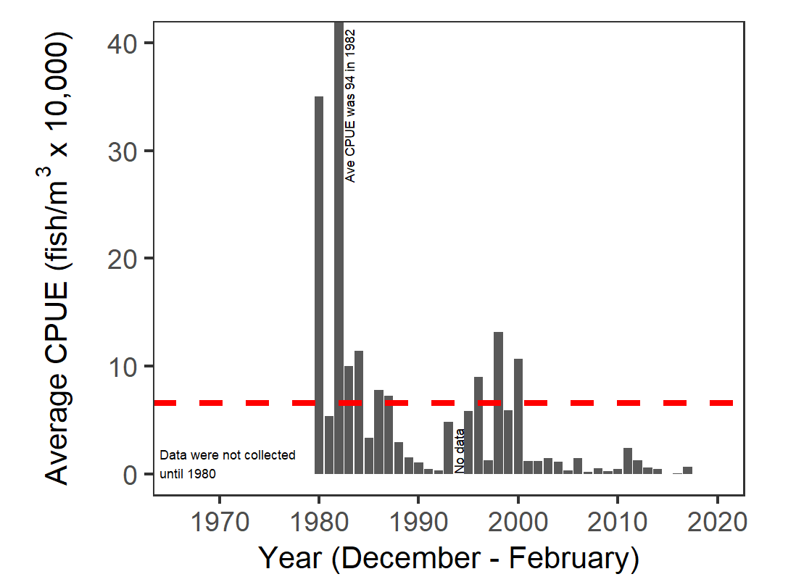
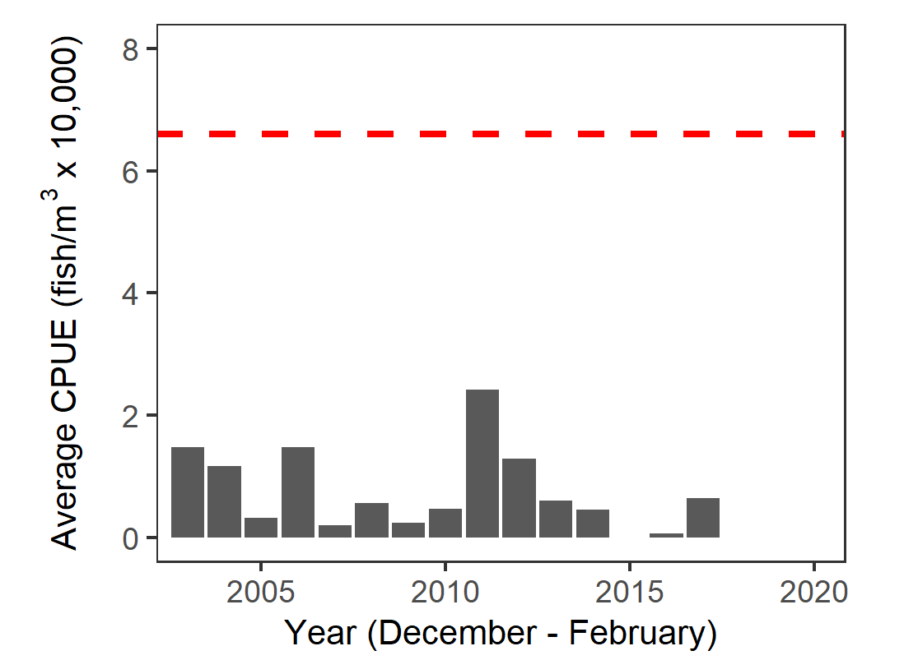
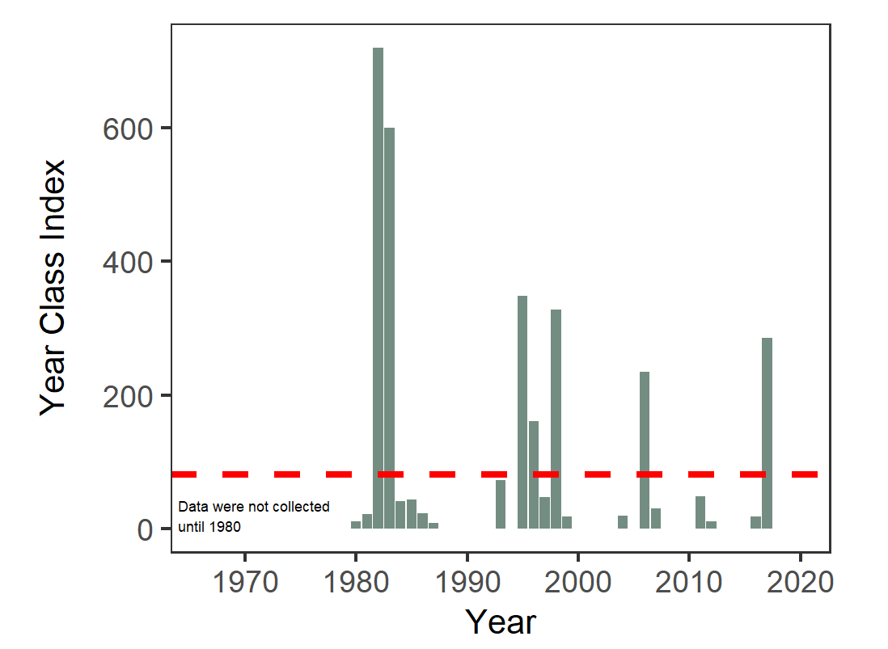
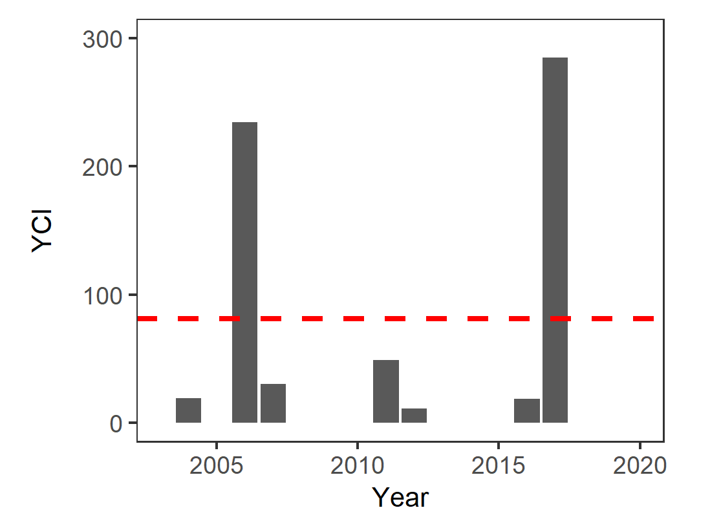

```{r setup, include=FALSE}
knitr::opts_chunk$set(echo = TRUE)
```

# Longfin Smelt

### Plot for All Years

filename: lonsme_plot_allYears.png




### Plot for Recent Years

filename: lonsme_plot_recent.png



# White Sturgeon

### Plot for All Years

filename: whistu_plot_allYears.png




### Plot for Recent Years

filename: whistu_plot_recent.png

