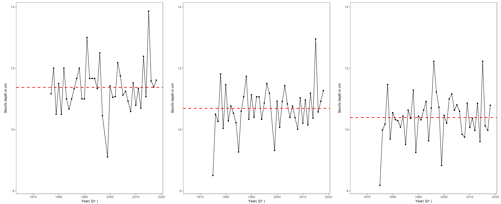

```{r setup, include=FALSE}
knitr::opts_chunk$set(echo = TRUE)
library(knitr)
```

## Background
- Organisms in this ecosystem are adapted to high turbidity conditions, and reductions in turbidity can have many negative ecological effects. 
- Higher values for Secchi depth indicate lower turbidity.
- Secchi depth is measured monthly by DWR’s Environmental Monitoring Program by dropping a black-and-white disk in the water until it disappears.
- Suisun Bay tends to have the lowest Secchi depth due to its extensive shallow areas and high winds.

### San Pablo Bay     Suisun Bay      Delta
```{r, out.width= 1000, echo = F, fig.align='center'}


```
In 2017, San Pablo bay was clearer than the long-term average.

Suisun Bay was about average
The Delta was somethign or other.
i don't know what i'm doing

[Back to Winter Menu](WinterWebsite.html)
