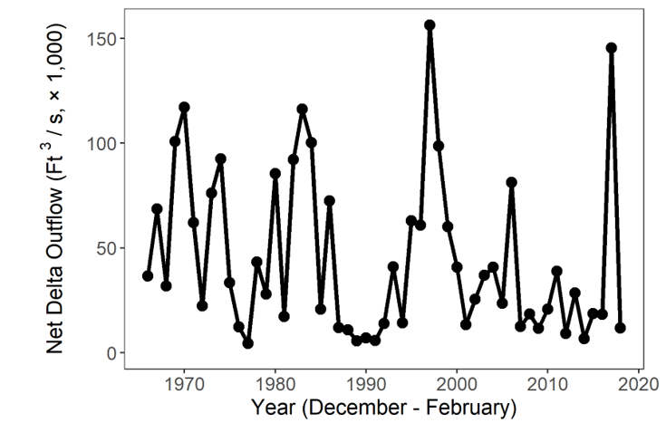

```{r setup, include=FALSE}
library(knitr)
knitr::opts_chunk$set(echo = TRUE)
```
# Winter Report 
## (December-February, through 2018)

### Delta Outflow
```{r, echo = F}

```
Freshwater flow influences water quality, plankton, and fish populations.
Winter flow is driven primarily by rainfall and upstream dam releases.

## Contents
- [Secchi Depth](SecchiWeb.html)
- [Temperature](TempWeb.html)
- [Zooplankton](ZooplanktonWeb.html)
- [Chlorophyll](ChloroWeb.html)
- Fish
- Recent fish trends
- Metadata

[Back to menu](index.html)
